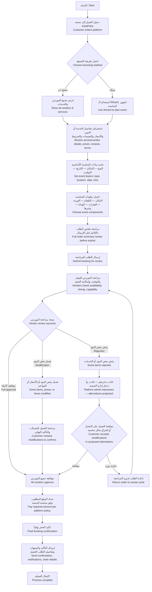

# InstaParty — Customer Journey Flowchart / مسار العميل

> **Source:** `InstaParty_Client_Journey_Flowchart_AR.pdf`
> **This document:** Reconstructed from Arabic flowchart with English translation. Original PDF text was extracted with reversed character order; below is the cleaned bilingual version with proper flow.

---

## Mermaid Flowchart

---

## Step-by-Step Description / وصف خطوة بخطوة

### 1. الدخول والتصفح / Entry & Discovery

**العربية:**

1. **البداية:** دخول العميل إلى منصة InstaParty
2. **اختيار طريقة التصفح:**
   - عرض جميع الموردين والخدمات (تصفح حر)
   - استخدام الـ Wizard لتجهيز المناسبة (موجَّه)
3. **استعراض التفاصيل:** الخدمة أو المورد، الأسعار، التقييمات، الشروط

**English:**

1. **Start:** Customer enters InstaParty platform
2. **Choose browsing path:**
   - Browse all vendors & services freely
   - Use guided Wizard to plan an event
3. **Review details:** service/vendor info, prices, ratings, terms & conditions

### 2. تحديد بيانات المناسبة / Event Setup

**العربية:**

4. **تحديد بيانات المناسبة الأساسية:**
   - النوع (عيد ميلاد، فرح، خطوبة، …)
   - المكان
   - التاريخ
   - التوقيت
5. **اختيار مكونات المناسبة:** المكان، الطعام، التورتة، الفقرات (الترفيهية)، الهدايا، وغيرها

**English:**

4. **Set event basics:**
   - Event type (birthday / wedding / engagement / …)
   - Location
   - Date
   - Time range
5. **Choose event components:** venue, food, cake, entertainment, gifts, etc.

### 3. المراجعة والإرسال / Review & Submit

**العربية:**

6. **مراجعة ملخص الطلب بالكامل** قبل الإرسال
7. **إرسال الطلب للمراجعة من قِبَل الموردين**

**English:**

6. **Full review** of the order summary before submission
7. **Submit booking** for vendor-side review

### 4. مراجعة الموردين / Vendor Review Phase

**العربية:**

8. **مراجعة الموردين** للتوفر، التوقيت، وإمكانية التنفيذ
9. **نتيجة المراجعة** (واحدة من ثلاث):
   - **موافقة جميع الموردين** على الطلب كما هو
   - **تعديل** بعض البنود أو الأسعار أو المواعيد
   - **رفض** بعض البنود أو الخدمات

**English:**

8. **Vendors check** availability, scheduling, and execution feasibility
9. **Outcome** — one of three:
   - **Full approval** by all vendors
   - **Modification** of some line items, prices, or times
   - **Rejection** of some items or services

### 5. حلقة التفاوض / Negotiation Loop

**العربية:**

10. **في حالة التعديل:** يراجع العميل التعديلات ويؤكد نهائياً
11. **في حالة الرفض:**
    - تتدخل إدارة المنصة لاقتراح بدائل مناسبة
    - يوافق العميل على التعديلات أو البدائل
    - يعيد الطلب لدورة المراجعة إذا لزم الأمر
12. **يمكن أن تتكرر الحلقة** بين العميل والمورد حتى الوصول لاتفاق نهائي

**English:**

10. **On modification:** customer reviews changes and confirms final
11. **On rejection:**
    - Platform admin intervenes to propose alternatives
    - Customer accepts modifications or proposed alternatives
    - Order returns to review cycle if needed
12. **Loop continues** between customer and vendor until alignment

### 6. السداد والتأكيد / Payment & Confirmation

**العربية:**

13. **سداد المبلغ المطلوب** وفق سياسة المنصة (مقدم / كامل)
14. **تأكيد الحجز نهائياً**
15. **إرسال التأكيد والتنبيهات** وتفاصيل الطلب للعميل
16. **اكتمال العملية**

**English:**

13. **Pay required amount** per platform policy (deposit or full)
14. **Final booking confirmation**
15. **Send confirmation + notifications + order details** to customer
16. **Process complete**

---

## Mapping to PRD & Tech Decisions

| Step | PRD Reference | Tech Implementation |
|---|---|---|
| 1–2 (entry, browsing path) | FR-1, FR-3, FR-4 | `bookings.lifecycle_status = draft`, `occasions` selection first |
| 4 (event setup) | FR-1, FR-2, BR-1 | Booking draft + `event_starts_at`, `event_ends_at` set |
| 5 (component selection) | FR-5, FR-7, FR-8 | `booking_items` rows; `service_inventory_reservations.status = held` (15-min TTL) |
| 6 (summary review) | FR-9 | Computed booking totals, snapshot for review |
| 7 (submit) | FR-10 | `lifecycle_status: draft → submitted`; reservations TTL → 24h |
| 8–9 (vendor review) | FR-10, FR-11 | `booking_vendors` rows per vendor with `response_deadline` |
| 10 (modification) | FR-12, FR-13, FR-14 | `booking_modifications` table + `diff_snapshot` JSON for highlighted UI |
| 11 (admin intervention) | FR-16, FR-17, FR-18 | Admin facilitates only; never picks alternative on customer's behalf |
| 12 (loop) | FR-15 | Multiple `booking_modifications` rows allowed |
| 13–14 (payment) | FR-28 (wallet related) | `payments` row, idempotency key, Paymob webhook |
| 15 (notifications) | FR-23 to FR-26 | `notification_dispatches` per channel per locale |
