# InstaParty — Vendor Journey Flowchart / مسار المورد

> **Source:** `InstaParty_Vendor_Journey_Flowchart_AR.pdf`
> **This document:** Reconstructed from Arabic flowchart with English translation.

---

## Mermaid Flowchart

```mermaid
flowchart TD
    A[البداية / Start] --> B[تسجيل المورد على المنصة<br/>وإدخال البيانات الأساسية<br/>Vendor signs up & enters basic info]
    B --> C[رفع المستندات والبيانات المطلوبة<br/>وبيانات الحساب البنكي والخدمات<br/>Upload documents, bank info, services]
    C --> D[مراجعة الإدارة لبيانات المورد<br/>Admin reviews vendor data]
    D --> E{نتيجة مراجعة الإدارة<br/>Admin review result}
    E -->|موافقة<br/>Approved| F[اعتماد المورد وتفعيل الحساب<br/>Approve vendor & activate account]
    E -->|نقص بيانات<br/>Incomplete| G[رفض البلاغ أو طلب استكمال البيانات<br/>Reject / request more info]
    G --> H[استكمال أو تعديل البيانات<br/>ودخول المورد إلى حسابه ثم إعادة الإرسال<br/>Vendor completes / edits data, resubmits]
    H --> D
    F --> I[إعداد الحساب التشغيلي<br/>الخدمات — الأسعار — الصور<br/>مناطق العمل — المواعيد<br/>Operational setup: services, prices, images, coverage areas, schedule]
    I --> J[مراجعة الإدارة للخدمات<br/>أو التعديلات الجوهرية<br/>Admin reviews services / material edits]
    J --> K{رد الإدارة<br/>Admin decision}
    K -->|قبول<br/>Approved| L[ظهور المورد وخدماته على المنصة<br/>Vendor & services live on platform]
    K -->|رفض / تعديل<br/>Reject / modify| M[تعديل الخدمات بناءً على الملاحظات<br/>Edit services per feedback]
    M --> J
    L --> N[إعدادات نقاط الولاء للمورد<br/>Vendor's loyalty points config]
    N --> O[قبول أو عدم قبول النقاط<br/>ونسبة الاستخدام المسموح بها<br/>Accept points & set redemption %]
    O --> P[استقبال التقييمات ومتابعة السمعة<br/>Receive reviews & monitor reputation]
    P --> Q[استقبال طلب جديد من عميل<br/>New booking request from customer]
    Q --> R[مراجعة الطلب والتأكد من<br/>التوفر والمكان والتوقيت<br/>Review request: availability, location, time]
    R --> S[شات مقيد مع العميل<br/>خلال فترة المراجعة فقط<br/>Restricted chat with customer<br/>during review window only]
    S --> T{قرار المورد على الطلب<br/>Vendor decision}
    T -->|موافقة<br/>Accept| U[موافقة على الطلب<br/>Accept order]
    T -->|تعديل<br/>Modify| V[تعديل البنود / السعر / التوقيت<br/>أو إضافة ملاحظات / رسوم / نقل<br/>Modify items / price / time / add notes / fees / delivery]
    T -->|رفض<br/>Reject| W[رفض الطلب<br/>Reject order]
    V --> X[عودة الطلب للعميل لاعتماد نهائي<br/>Order returns to customer for final approval]
    W --> X
    U --> Y[سداد العميل أو تدخل الإدارة<br/>عند الحاجة<br/>Customer pays / admin intervenes if needed]
    X --> Y
    Y --> Z[احتساب أثر نقاط الولاء<br/>على الطلبات المؤهلة<br/>Calculate loyalty point impact]
    Z --> AA[تنفيذ الخدمة / تجهيز الطلبية<br/>وتحديث حالة التنفيذ<br/>Execute service / fulfill order, update status]
    AA --> AB[إضافة مستحقات المورد إلى المحفظة<br/>بعد خصم العمولة والتسويات<br/>Credit vendor wallet after commission & adjustments]
    AB --> AC[إدارة المحفظة<br/>الرصيد — الحركات — المستحقات<br/>Wallet management: balance, transactions, dues]
    AC --> AD[طلب سحب رصيد من المحفظة<br/>Withdrawal request]
    AD --> AE[مراجعة الإدارة لطلب السحب<br/>ثم التحويل البنكي<br/>Admin approves withdrawal, then bank transfer]
    AE --> AF[تأكيد التحويل وإظهار إثبات السداد<br/>Transfer confirmed, proof shown]
    AF --> AG[استمرار التشغيل والمتابعة الدورية<br/>Continue operations / periodic follow-up]
    AG --> Q
```

---

## Step-by-Step Description / وصف خطوة بخطوة

### 1. التسجيل والاعتماد / Registration & Approval

**العربية:**

1. **البداية:** المورد يدخل المنصة كمستخدم جديد ويختار التسجيل كمورد
2. **إدخال البيانات الأساسية** للمورد (اسم النشاط، نوع النشاط، …)
3. **رفع المستندات** المطلوبة:
   - بطاقة الرقم القومي / السجل التجاري / البطاقة الضريبية
   - بيانات الحساب البنكي
   - قائمة الخدمات الأولية
4. **مراجعة الإدارة:**
   - **اعتماد** المورد وتفعيل الحساب
   - أو **طلب استكمال البيانات** (يعود المورد لتعديلها وإعادة الإرسال)

**English:**

1. **Start:** vendor signs up
2. **Basic data entry:** business name, business type, …
3. **Document upload:** CR / national ID / tax card / bank info / initial service list
4. **Admin review:**
   - **Approve** → activate vendor account
   - **Request more info** → vendor completes/fixes data and resubmits

> Schema mapping: `vendor_profiles.approval_status`, `vendor_documents`, `vendor_approved_product_types` (per-type approval)

### 2. الإعداد التشغيلي / Operational Setup

**العربية:**

5. **إعداد الحساب التشغيلي:**
   - الخدمات (rental / sale / digital)
   - الأسعار
   - الصور
   - مناطق العمل
   - المواعيد
6. **مراجعة الإدارة** للخدمات الجديدة أو التعديلات الجوهرية:
   - **قبول** → ظهور المورد وخدماته على المنصة
   - **رفض / طلب تعديل** → يعود المورد لتعديل الخدمة

**English:**

5. **Operational setup:** services (per type), prices, images, coverage areas, schedule
6. **Admin moderates** new services / material edits:
   - **Approve** → vendor + services go live
   - **Reject / request changes** → vendor edits and resubmits

> Schema: `services.status` (`draft`, `pending_review`, `published`, `rejected`, `archived`), `vendor_coverage_areas`, `vendor_business_hours`

### 3. نقاط الولاء والتقييمات / Loyalty & Reviews

**العربية:**

7. **إعدادات نقاط الولاء** الخاصة بالمورد:
   - قبول أو عدم قبول النقاط
   - نسبة الاستخدام المسموح بها
8. **استقبال التقييمات** ومتابعة السمعة على المنصة

**English:**

7. **Per-vendor loyalty config:**
   - Opt-in / opt-out
   - Max redeem percentage per booking
8. **Receive reviews + monitor reputation**

> Schema: `loyalty_programs` (per-vendor), `loyalty_rules`, `service_reviews`, `vendor_reviews`

### 4. دورة الطلب / Booking Cycle

**العربية:**

9. **استقبال طلب جديد من عميل**
10. **مراجعة الطلب** والتأكد من:
    - التوفر
    - المكان
    - التوقيت
11. **شات مقيد** مع العميل خلال فترة المراجعة فقط
12. **القرار** (واحد من ثلاث):
    - **الموافقة على الطلب**
    - **تعديل** على البنود أو السعر أو التوقيت، أو إضافة ملاحظات / رسوم / نقل
    - **رفض** الطلب

**English:**

9. **Receive new booking request** from a customer
10. **Review** for: availability, location, timing
11. **Restricted chat** with customer (only during review window)
12. **Decision** (one of three):
    - **Accept**
    - **Modify** items / price / time, add notes / fees / delivery
    - **Reject**

> Schema: `booking_vendors.sub_status` (`pending`, `accepted`, `modified`, `rejected`, `cancelled`, `in_progress`, `completed`), `booking_modifications`

### 5. الإكمال / Completion

**العربية:**

13. **عودة الطلب للعميل لاعتماد نهائي** ودفع المستحق
14. **يمكن تدخل الإدارة عند الحاجة**
15. **احتساب أثر نقاط الولاء** على الطلبات المؤهلة
16. **تنفيذ الخدمة / تجهيز الطلبية** وتحديث حالة التنفيذ
17. **إضافة مستحقات المورد إلى المحفظة** بعد خصم العمولة والتسويات

**English:**

13. **Order returns to customer** for final acceptance + payment
14. **Admin can intervene** if needed
15. **Loyalty points** credited on qualifying orders
16. **Service execution / order fulfillment** with status updates
17. **Wallet credit** after commission deduction and settlement adjustments

> Schema: `payments`, `commissions`, `wallet_ledger`, `booking_items.item_status` (per-type state machine)

### 6. إدارة المحفظة / Wallet & Withdrawals

**العربية:**

18. **إدارة المحفظة:** الرصيد، الحركات، المستحقات
19. **طلب سحب رصيد** من المحفظة
20. **مراجعة الإدارة لطلب السحب** ثم التحويل البنكي
21. **تأكيد التحويل وإظهار إثبات السداد**
22. **استمرار التشغيل والمتابعة الدورية**

**English:**

18. **Wallet view:** balance, transactions, pending dues
19. **Withdrawal request**
20. **Admin reviews + approves**, executes bank transfer
21. **Transfer confirmation** + proof attached
22. **Continued operations / periodic follow-up**

> Schema: `wallets`, `wallet_ledger` (append-only), `withdrawals`, `settlement_runs`

---

## Mapping to PRD & Tech Decisions

| Step | PRD Reference | Tech Implementation |
|---|---|---|
| 1–4 | FR-19, BR-5 | `vendor_profiles.approval_status`, `vendor_documents`, `vendor_approved_product_types` |
| 5–6 | FR-19 to FR-22 | Per-type service creation actions, `services.status` lifecycle |
| 7 | Loyalty (Software Description §6) | `loyalty_programs` per vendor |
| 8 | Reviews (Software Description §3) | `service_reviews` + `vendor_reviews` |
| 9–12 | FR-10 to FR-15 | `booking_vendors.sub_status`, `booking_modifications`, restricted chat (`chat_threads.status = open` only during review) |
| 13–17 | FR-12, FR-15, FR-30 | Per-type fulfillment state machine, commission calculation, `wallet_ledger` |
| 18–22 | FR-28, FR-29 | `wallets`, `withdrawals`, settlement |
