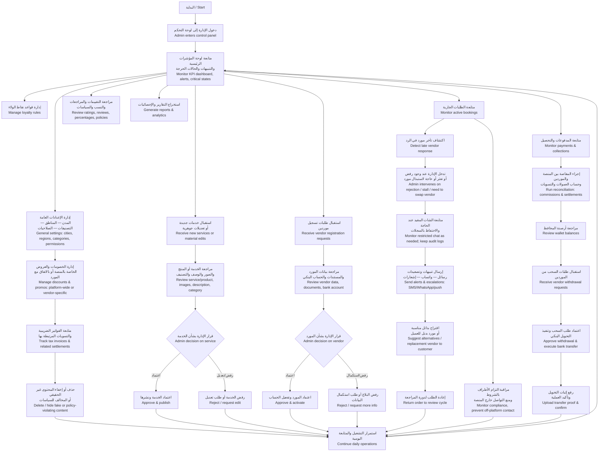

# InstaParty — Admin Journey Flowchart / مسار الإدارة

> **Source:** `InstaParty_Admin_Journey_Flowchart_AR.pdf`
> **This document:** Reconstructed from Arabic flowchart with English translation.

---

## Mermaid Flowchart

---

## Step-by-Step Description / وصف خطوة بخطوة

### 1. لوحة التحكم الرئيسية / Main Dashboard

**العربية:**

1. **البداية:** دخول الإدارة إلى لوحة التحكم
2. **متابعة لوحة المؤشرات الرئيسية**:
   - التنبيهات والحالات الحرجة
   - الطلبات المتأخرة
   - طلبات التسجيل المعلقة
   - الخدمات بانتظار المراجعة
   - مؤشرات الأداء العامة

**English:**

1. **Start:** Admin enters Filament panel at `/admin`
2. **Monitor main dashboard:**
   - Alerts & critical states
   - Overdue bookings
   - Pending vendor approvals
   - Services awaiting moderation
   - General KPIs

> Filament: dashboard widgets summarizing per-type, per-status counts

### 2. اعتماد الموردين / Vendor Approval

**العربية:**

3. **استقبال طلبات تسجيل الموردين**
4. **مراجعة بيانات المورد**: المستندات، الحساب البنكي
5. **القرار:**
   - **اعتماد** → تفعيل الحساب
   - **رفض / طلب استكمال** → يعود المورد لإكمال البيانات

**English:**

3. **Receive vendor registration requests**
4. **Review:** documents, bank info, business details
5. **Decision:**
   - **Approve** → activate account, optionally per product type (rental/sale/digital)
   - **Reject / request more info**

> Filament: Vendor Approval Queue, with **per-product-type approval** action buttons

### 3. اعتماد الخدمات / Service Moderation

**العربية:**

6. **استقبال الخدمات الجديدة أو التعديلات الجوهرية**
7. **مراجعة الخدمة:** الصور، الوصف، التصنيف
8. **القرار:**
   - **اعتماد ونشر**
   - **رفض / طلب تعديل**

**English:**

6. **Receive new services or material edits** (every type: rental/sale/digital)
7. **Review:** content, images, description, category, pricing
8. **Decision:**
   - **Approve & publish**
   - **Reject / request edits**

> Filament: separate moderation queues per product type — `RentalServiceResource`, `SaleServiceResource`, `DigitalServiceResource`

### 4. متابعة الطلبات الجارية / Active Booking Monitoring

**العربية:**

9. **متابعة الطلبات الجارية** والكشف عن الاحتمالات:
   - **تأخر مورد في الرد** → تدخل الإدارة
   - **رفض من مورد** → اقتراح بدائل
   - **حاجة لاستبدال مورد** → الاقتراح فقط (العميل يقرر)
10. **متابعة الشات المقيد** عند الحاجة، مع الاحتفاظ بالسجلات
11. **إرسال تنبيهات وتصعيدات**: SMS / واتساب / إشعارات
12. **اقتراح بدائل مناسبة** للعميل
13. **إعادة الطلب لدورة المراجعة** إذا لزم الأمر

**English:**

9. **Monitor active bookings** for:
   - **Late vendor response** → admin intervenes
   - **Vendor rejection** → propose alternatives
   - **Need to swap vendor** → propose only (customer chooses, per FR-17)
10. **Monitor restricted chat** when needed; keep audit logs
11. **Send alerts & escalations** (SMS / WhatsApp / push)
12. **Suggest alternatives** to customer
13. **Return order to review cycle** as needed

> Schema: `booking_vendors.response_deadline`, `booking_state_transitions` (audit), `chat_threads.status` (lock when admin freezes), `notification_dispatches`

> **Critical (FR-17):** Admin **never** picks the alternative on the customer's behalf — only proposes options.

### 5. مراقبة الالتزام / Compliance Monitoring

**العربية:**

14. **مراقبة التزام الأطراف بالشروط**
15. **منع التواصل خارج المنصة**:
   - فلترة أرقام التليفون والبريد الإلكتروني في الشات
   - علامات على الرسائل المشكوك فيها

**English:**

14. **Monitor compliance** with platform T&C
15. **Prevent off-platform communication:**
    - Phone & email regex filter on chat
    - Flag suspicious messages for review

> Schema: `chat_moderation_flags`, `chat_message_log` (audit mirror of Firestore)

### 6. التسويات والمحافظ / Settlements & Wallets

**العربية:**

16. **إجراء المقاصة بين المنصة والموردين** + حساب العمولات والتسويات
17. **مراجعة أرصدة المحافظ**
18. **استقبال طلبات السحب** من الموردين
19. **اعتماد طلب السحب وتنفيذ التحويل البنكي**
20. **رفع إثبات التحويل** وتأكيد العملية

**English:**

16. **Run reconciliation** between platform and vendors + commission & settlement calculation
17. **Review wallet balances**
18. **Receive withdrawal requests** from vendors
19. **Approve withdrawal & execute bank transfer**
20. **Upload transfer proof** & confirm

> Schema: `settlement_runs`, `commissions.status`, `wallet_ledger` (append-only), `withdrawals.status` (`requested → approved → processing → paid`)

### 7. الإعدادات والعمليات اليومية / Settings & Daily Ops

**العربية:**

21. **إدارة الإعدادات العامة**:
    - المدن، المناطق، المحافظات
    - التصنيفات (عيد ميلاد، فرح، …)
    - مجموعات الصلاحيات
22. **إدارة قواعد نقاط الولاء** (مستوى المنصة + لكل مورد)
23. **إدارة الخصومات والعروض**:
    - الخاصة بالمنصة
    - أو بالاتفاق مع المورد
24. **متابعة الفواتير الضريبية والتسويات المرتبطة بها** (أساسي في Phase 1، متقدم في Phase 2)
25. **حذف أو إخفاء المحتوى غير الحقيقي أو المخالف للسياسات**
26. **مراجعة التقييمات والمراجعات** (إدارة محتوى)
27. **استخراج التقارير والإحصائيات** (مع تقسيم لكل نوع منتج)
28. **استمرار التشغيل والمتابعة اليومية** ← الرجوع للوحة الرئيسية

**English:**

21. **Manage general settings:**
    - Cities, regions, governorates
    - Categories (birthday, wedding, …)
    - Roles & permissions
22. **Manage loyalty rules** (per-vendor configurable)
23. **Manage discounts & promos:**
    - Platform-wide
    - Or in agreement with a vendor
24. **Track tax invoices & related settlements** (foundational in Phase 1; advanced is Phase 2)
25. **Delete / hide fake or policy-violating content**
26. **Review ratings & reviews** (content moderation)
27. **Generate reports & analytics** (with per-product-type breakdowns)
28. **Continue daily operations** ← back to dashboard

> Filament resources: Settings (occasions, categories, regions, cities, governorates), Loyalty Programs, Reviews Moderation, Reports & Dashboards (with per-type breakdowns)

---

## Mapping to PRD & Tech Decisions

| Step | PRD Reference | Tech Implementation |
|---|---|---|
| 1–2 | FR-29 (admin oversight) | Filament dashboard widgets per module |
| 3–5 | FR-29 | Vendor approval flow + `vendor_approved_product_types` |
| 6–8 | FR-19, FR-22 (admin moderation gate) | Per-type Filament resources, `services.status` lifecycle |
| 9–13 | FR-16, FR-17, FR-18 | Admin facilitates only; no auto-replacement |
| 14–15 | NFR (auditability) | Chat moderation, audit logs |
| 16–20 | FR-28, FR-29, FR-30 | Settlement, commission, wallet, withdrawals |
| 21–28 | FR-23 to FR-27 | Settings management, campaigns, reports, content moderation |

---

## Key Admin Boundaries (Phase 1)

These are **explicit constraints** on admin behavior, not just "nice-to-haves":

| Constraint | Why |
|---|---|
| Admin **does not** select replacement vendors on customer's behalf | FR-17, BR-4 |
| Admin **never** edits customer-vendor chat content (only freezes/audits) | Trust + audit integrity |
| Admin **must approve** material service edits (price, description) | Vendor governance |
| Admin **must use** per-type approval for new vendors when applicable | Tech Decisions §2.4 |
| Admin **cannot** issue refunds outside the per-type refund policy without override audit | Tech Decisions §11 + audit log |
